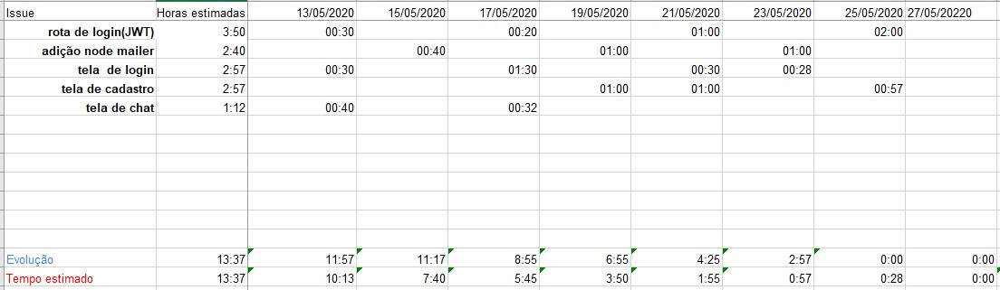
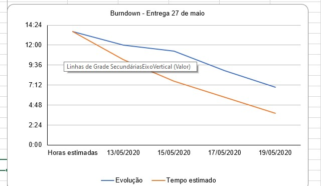

# Sistema
O capítulo 6 Lei Geral de Proteção de Dados(LGPD) dispõe sobre os agente de tratamenteo de Dados Pessoas e na segundo seção deste capítulo encontra-se informação sobre o Encarregado pelo Tratamento de Dados Pessoas (DPO, em inglês Data Protection Officer). Dentro desta seção encontra-se uma descrição das atividades do DPO e entre as suas atividades podemos citar: 

* I - aceitar reclamações e comunicações dos titulares, prestar esclarecimentos e adotar providências; 
* II - receber comunicações da autoridade nacional e adotar providências; 

A LGPD possibilita a terceirização, indicação de uma pessoa jurídica junto a autoridade nacional para assumir esta função. Podendo uma pessoa jurídica responder a mais de uma empresa.

Pensando nisso, propõe-se uma plataforma para centralização das atividades de receber comunicados(reclamações e comunicações) e seus evenetuais desdobramentos (respostas). 

A aplicação será no estilo de chat onde uma conversa representa um comunicado e seus desdobramentos são as respostas desta conversa.

Um comunicado pode ser aberto por uma pessoa ou pela autoridade nacional

Um DPO poderá fazer seu cadastro na plataforma e cadastrar as empresas para qual prestar serviço para passar a receber os comunicados pela plataforma. 

Além disso, teremos uma tela com a lista do DPOs cadastrados afim de torná-los acessíveis para contratação de novas empresas.

## Entregas
### Backend
  **Sprint 1**
   - Criação de API REST com express
   - Adição de ORM
   - Adição dos modelos Comunicado e Resposta
   - Rotas de comunicado (get, post, put e delete)
     - crud de comunicado
   - Rotas de reposta (get, post, put e delete)
     - crud das resposta de um comunicado
   - Geração de chave de acesso para o comunicado
  **Sprint 2**
   - Adição do Modelo DPO
   - Rotas de DPO (get, post, put e delete);
    - Crud de DPO
    - Geração de hash de senha do DPO
   - Rotas de Validação de chave de acesso ao Comunicado

### FrontEnd
   **Sprint 1**
   - Criação de projeto react 
   - Adição de biblioteca Material-UI
   - Adição de telas e comportamentos
    - Tela de Chat
    - Tela de lista de comunicados

   **Sprint 2**
   - Tela de chat
    - Carregamento de mensagens já enviadas
    - Adição de novas mensagens
    - Cores diferentes para mensagens de DPO
    - Modal para adicionar chave(token) de acesso a conversa
   - Tela de lista de comunicados
    - Carregamento de comunicado abertos
    - Direcionamento para tela com mensagens do comunicado
   - Adição de tela de cadastro comunicado
    - Formulário para cadastramento de comunicado

## BurnDown 

### Tabela

### Gráfico

## Tecnologias

* React.js
* Node.js

## Integrantes
* [Gabriel Carvalho](https://github.com/Gamebielo)
* [Lucas Salvador](https://github.com/LASalvador)
* [Lucas Ribeiro](https://github.com/lrsonnewend)
* [Mayara Brígida](https://github.com/mayaramedeiros)
* [Paulo Henrique Correia](https://github.com/PauloHenrique7010)
